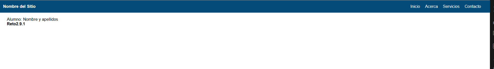
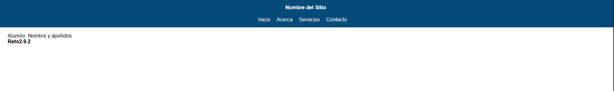
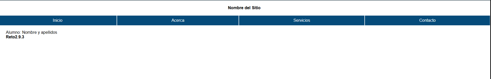

# Reto2.9

Nombre y Apellidos: Pablo Rodríguez Crespo
URL del repositorio de gitlab: https://github.com/Pablosax9/ODAW2_RETO.2.9_flexbox3.git

## Enunciado

2.9.1. Crea un encabezado que tenga un elemento a la izquierda (texto o imagen) y otro a la derecha (menú de navegación).  
Para este ejercicio se utiliza un contenedor principal \<header> y se distribuye el espacio de los elementos contenidos con justify-content: space-between. Los elementos del menú de navegación se establecen de tipo flex para alineación horizontal uno detrás del otro.

2.9.2 Crea un encabezado que tenga un elemento arriba (texto o imagen) y otro abajo (menú de navegación). Ambos elementos deben encontrarse centrados.
Para este ejercicio se utiliza un contenedor principal \<header> y se alinean verticalmente sus elementos hijos con flex-direction: column. Los elementos del menú de navegación se establecen de tipo flex para alineación horizontal uno detrás del otro.

2.9.3 Crea un menú de navegación que ocupe el ancho total de la pantalla y que sus elementos crezcan para ocupar de forma uniforme el ancho total.
Para este ejercicio utilizamos la propiedad flex-grow para que los elementos del menú crezcan hasta ocupar el ancho total del menú de navegación.